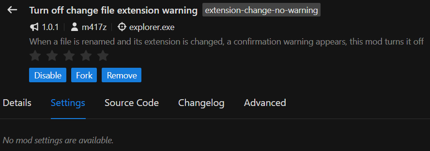
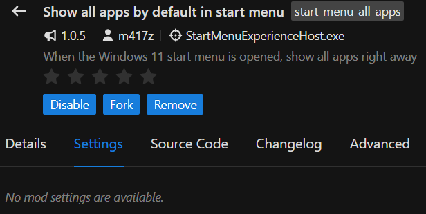
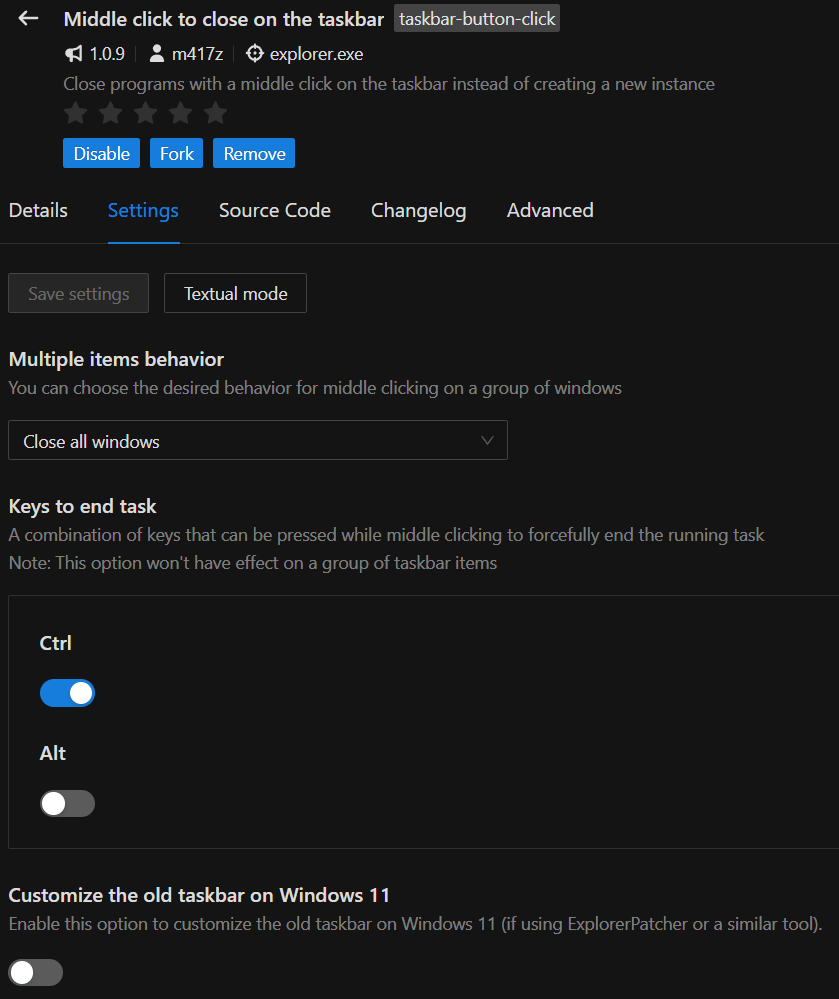
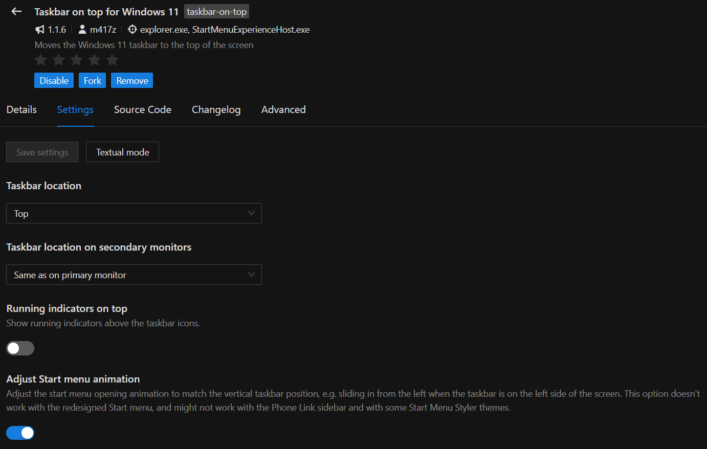
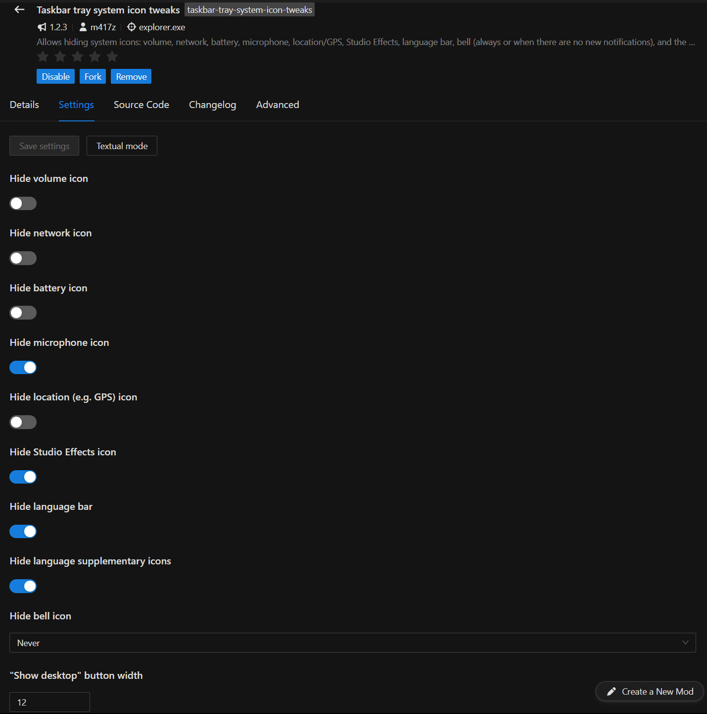
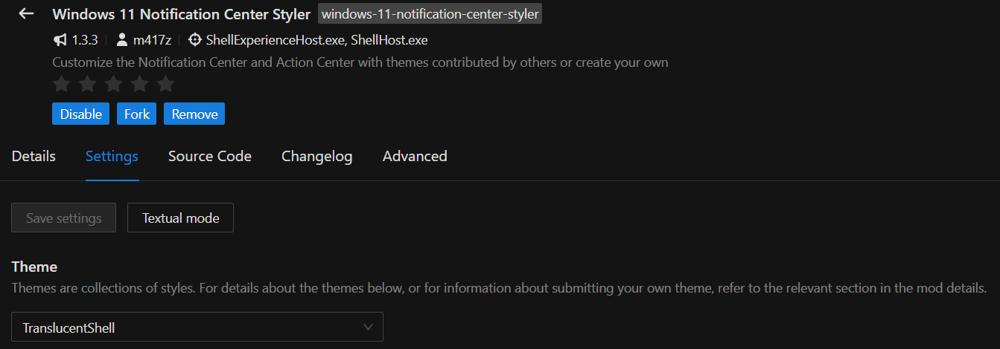
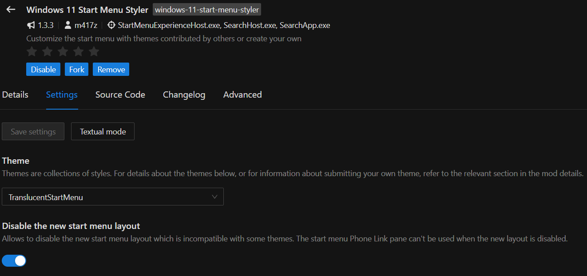
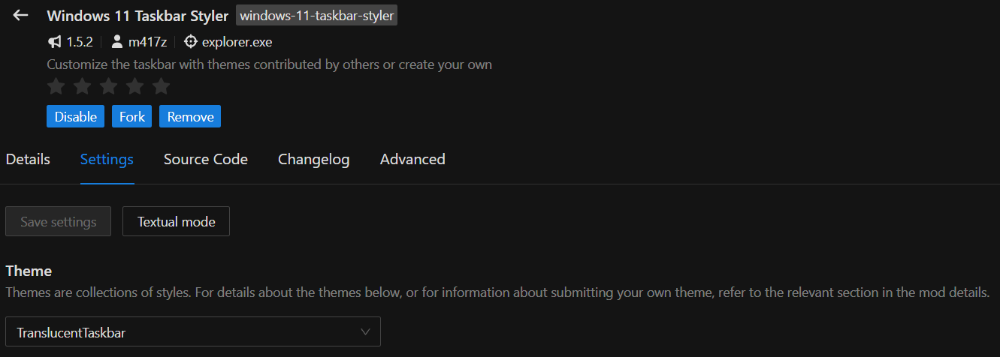

My desktop setup config files, for both **Windows** and ~~**Linux** (soon)~~

## 🔤 Fonts

- **[Fira Code](https://github.com/ryanoasis/nerd-fonts/releases/latest)**
- **[JetBrains Mono](https://github.com/ryanoasis/nerd-fonts/releases/latest)**

## 🪟 Windows


- **[Wallpaper Engine](https://store.steampowered.com/app/431960)**
- **[Windhawk](https://windhawk.net)**
- **[YASB](https://github.com/amnweb/yasb?tab=readme-ov-file#installation)**
- **[Fastfetch](https://github.com/fastfetch-cli/fastfetch?tab=readme-ov-file#windows)**

## ⚙️ YASB auto-start

Paste this command in an admin PowerShell session to auto-start YASB at user logon with high priority.

```
schtasks /create /f /rl highest /sc onlogon /ru "$env:USERNAME" /it /tn "YASB" /tr 'cmd.exe /c start "" /high "C:\Program Files\YASB\yasb.exe"'
```

### 🖼️ Wallpaper
- **[Wallpaper Engine](https://steamcommunity.com/sharedfiles/filedetails/?id=1382838434)**
- **[Static](./images/wallpaper-static.jpg)** ([original](https://www.pexels.com/photo/grayscale-photography-of-mountain-234272/))

### 🖥️ Windows Terminal color scheme

**Get it [here](https://windowsterminalthemes.dev/?theme=OneDark)**.

Learn how to install the color scheme [here](https://learn.microsoft.com/en-us/windows/terminal/customize-settings/color-schemes).

### 🎨 Windhawk mods

| | |
|---|---|
|  |  |
|  |  |
|  |  |
|  |  |

### 🚀 Apply configurations

Run this command to automatically apply the configurations:

```
git clone https://github.com/madkarmaa/dotfiles
cd .\dotfiles\windows\scripts
.\apply.ps1 # yasb, powershell, fastfetch, all
```

<small><i>First time ricing, I hope you like it :P</i></small>