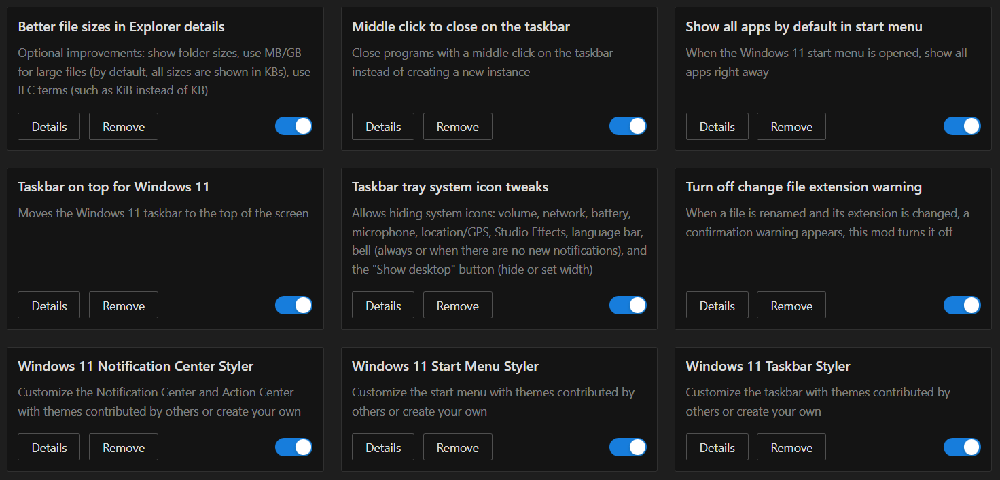
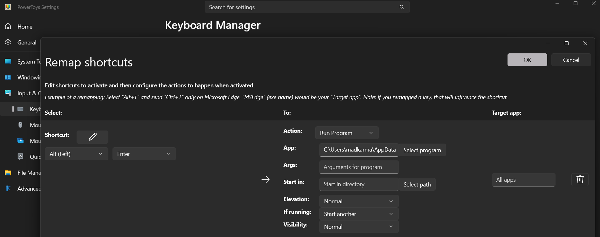

My desktop setup configuration files for both **Windows** and ~~**Linux** (soon)~~

## 🔤 Fonts

- **[Fira Code](https://github.com/ryanoasis/nerd-fonts/releases/latest)**
- **[JetBrains Mono](https://github.com/ryanoasis/nerd-fonts/releases/latest)**

## 🪟 Windows


### 🚀 Apply configurations

Run these commands in an **admin** PowerShell session to automatically install the required software and apply the configurations:

```
git clone https://github.com/madkarmaa/dotfiles --depth 1
# windhawk, yasb, flowlauncher, powershell, fastfetch, cava, powertoys, all (defaults to all)
powershell.exe -NoProfile -ExecutionPolicy Bypass -Command ".\dotfiles\windows\scripts\apply.ps1 all"
```

### 💻 Software

- **[Wallpaper Engine](https://store.steampowered.com/app/431960)** (Steam)
- **[Cava](https://github.com/karlstav/cava/releases/latest)**
- **[AcrylicMenus](https://github.com/krlvm/AcrylicMenus/releases/latest)**

- **[Windhawk](https://windhawk.net)**

```
winget install -e --id RamenSoftware.Windhawk
```

- **[YASB](https://github.com/amnweb/yasb)**

```
winget install -e --id AmN.yasb
```

- **[Flow Launcher](https://github.com/Flow-Launcher/Flow.Launcher)**

```
winget install -e --id Flow-Launcher.Flow-Launcher
```

- **[Fastfetch](https://github.com/fastfetch-cli/fastfetch)**

```
winget install -e --id Fastfetch-cli.Fastfetch
```

- **[PowerToys](https://learn.microsoft.com/en-us/windows/powertoys/install#install-with-windows-package-manager)**

```
winget install -e --id Microsoft.PowerToys --source winget
```

### 🖼️ Wallpaper
- **[Wallpaper Engine](https://steamcommunity.com/sharedfiles/filedetails/?id=3141120842)**

### 🖥️ Windows Terminal color scheme

**Get it [here](https://windowsterminalthemes.dev/?theme=OneDark)**.

Learn how to install the color scheme **[here](https://learn.microsoft.com/en-us/windows/terminal/customize-settings/color-schemes)**.

### 🎨 Windhawk mods

Enable these mods (configuration will be applied automatically in the registry):



### ⚙️ PowerToys settings

Paste this command in a **CMD** session to get the path of the Windows Terminal executable to paste in the "**App**" section:

```
where wt.exe
```



<small><i>First time ricing, I hope you like it :P</i></small>