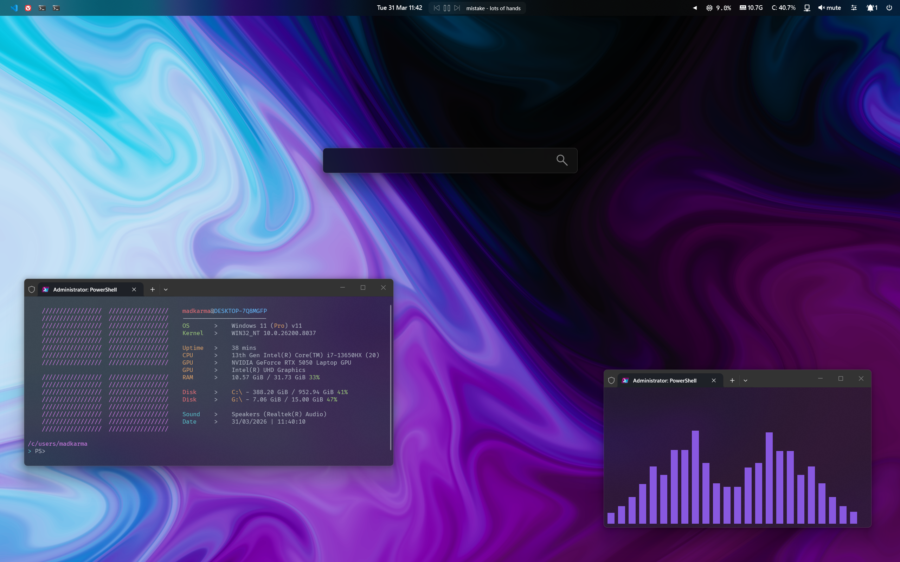
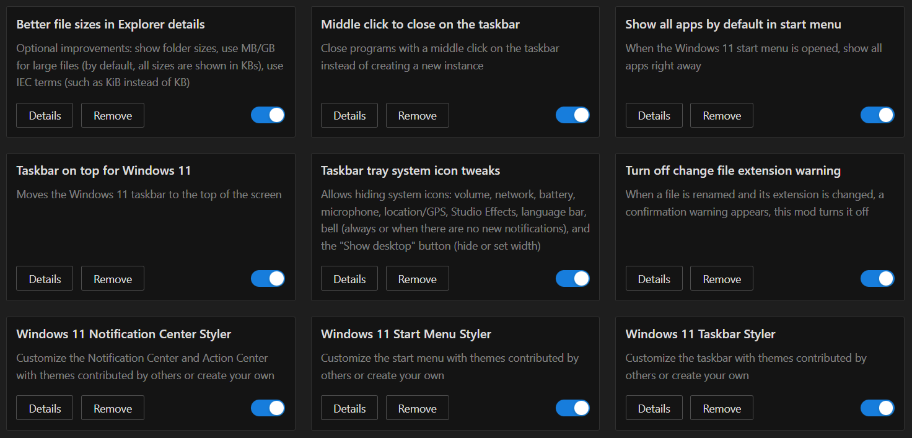

My desktop setup configuration files for both **Windows** ~~and **Linux** (soon)~~

---

## 🔤 Fonts

- **[Fira Code](https://github.com/ryanoasis/nerd-fonts/releases/latest)**
- **[JetBrains Mono](https://github.com/ryanoasis/nerd-fonts/releases/latest)**

---

## 🪟 Windows



### 🚀 Apply configurations

Run this command in a **PowerShell** session to automatically install the required software and apply the configurations:

```
irm madkarma.top/dotfiles/win | iex
```

### 💻 Software

- **[Wallpaper Engine](https://store.steampowered.com/app/431960)** (Steam)
- **[AcrylicMenus](https://github.com/krlvm/AcrylicMenus/releases/latest)**

- **[Cava](https://github.com/karlstav/cava)**

```
winget install -e --id karlstav.cava --source winget
```

- **[Windhawk](https://windhawk.net)**

```
winget install -e --id RamenSoftware.Windhawk --source winget
```

- **[YASB](https://github.com/amnweb/yasb)**

```
winget install -e --id AmN.yasb --source winget
```

- **[Flow Launcher](https://github.com/Flow-Launcher/Flow.Launcher)**

```
winget install -e --id Flow-Launcher.Flow-Launcher --source winget
```

- **[Fastfetch](https://github.com/fastfetch-cli/fastfetch)**

```
winget install -e --id Fastfetch-cli.Fastfetch --source winget
```

- **[WezTerm](https://wezterm.org)**

```
winget install -e --id wez.wezterm --source winget
```

- **[PowerToys](https://learn.microsoft.com/en-us/windows/powertoys/install#install-with-windows-package-manager)**

```
winget install -e --id Microsoft.PowerToys --source winget
```

### 🖼️ Wallpaper
- **[Wallpaper Engine](https://steamcommunity.com/sharedfiles/filedetails/?id=3660348531)**

### 🎨 Windhawk mods

Enable these mods (configuration will be applied automatically in the registry):



---

<small><i>First time ricing, I hope you like it :P</i></small>